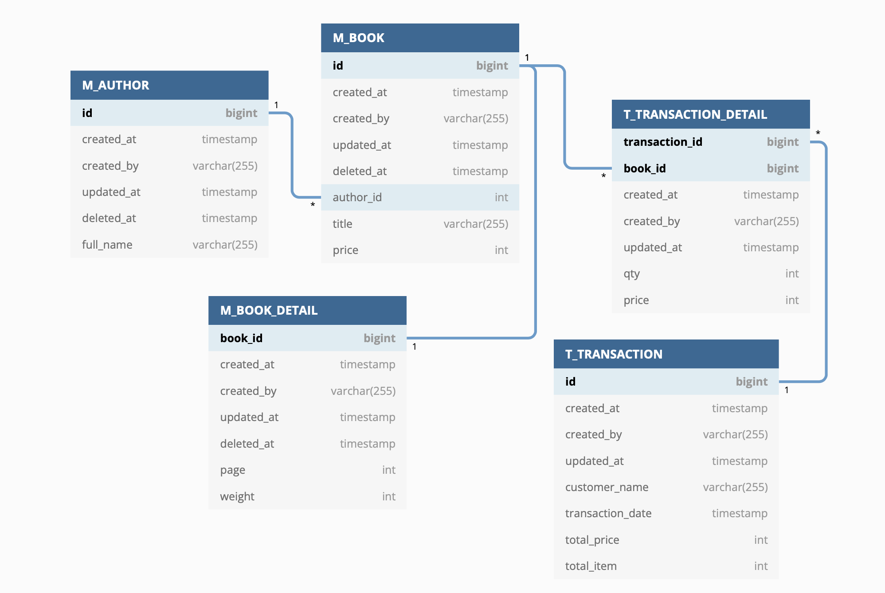

## Overview

Deleting data permanently from a table is a common requirement when interacting with database. But, sometimes there are business requirements to not permanently delete data from the database. The solution is we just hide that data so that can't be accessed from the front-end.

In this documentation, I will share how I implementing custom JPA repository with soft deletes using `JpaRepositoryFactoryBean`. So, that data can be tracked or audited when is created, updated, or deleted. For example, let's design a table with a book sale case study like this. There are `created_at`, `created_by`, `updated_at` and `deleted_at` fields. Some case `updated_at` can be replace with `modified_at` and `modified_by`. But, the point is `deleted_at` field.



## Project Setup and Dependency
I'm depending [Spring Initializr](https://start.spring.io/) for this as it is much easier.

We need `spring-boot-starter-data-jpa`, `spring-boot-starter-web`, `lombok` and `h2database`. There is my `pom.xml`.

```xml
<dependency>
    <groupId>org.springframework.boot</groupId>
    <artifactId>spring-boot-starter-data-jpa</artifactId>
</dependency>
<dependency>
    <groupId>org.springframework.boot</groupId>
    <artifactId>spring-boot-starter-web</artifactId>
</dependency>

<dependency>
    <groupId>org.projectlombok</groupId>
    <artifactId>lombok</artifactId>
    <optional>true</optional>
</dependency>
<dependency>
    <groupId>org.springframework.boot</groupId>
    <artifactId>spring-boot-starter-test</artifactId>
    <scope>test</scope>
</dependency>

<dependency>
    <groupId>com.h2database</groupId>
    <artifactId>h2</artifactId>
    <scope>runtime</scope>
</dependency>
```

Change configuration `application.properties` file like following below.

```sh
server.port=8080
spring.application.name=custom-soft-deletes
server.servlet.context-path=/api

spring.datasource.url=jdbc:h2:mem:db;
spring.datasource.driverClassName=org.h2.Driver
spring.datasource.username=sa
spring.datasource.password=password
spring.jpa.database-platform=org.hibernate.dialect.H2Dialect
spring.h2.console.enabled=true
spring.jpa.show-sql=true
```

## Implementation

**Soft Deletes Repository Interface**

Create an interface `SoftDeletesRepository<T, ID>` which will be used to replace the repository that inherit from `JpaRepository<T, ID>`.

```java
@SuppressWarnings("java:S119")
@Transactional
@NoRepositoryBean
public interface SoftDeletesRepository<T, ID extends Serializable> extends PagingAndSortingRepository<T, ID> {

    @Override
    Iterable<T> findAll();

    @Override
    Iterable<T> findAll(Sort sort);

    @Override
    Page<T> findAll(Pageable page);

    Optional<T> findOne(ID id);

    @Modifying
    void delete(ID id);

    @Override
    @Modifying
    void delete(T entity);

    void hardDelete(T entity);

}
```

Create an implementation from `SoftDeletesRepository<T, ID>` interface class.

```java
@SuppressWarnings("java:S119")
@Slf4j
public class SoftDeletesRepositoryImpl<T, ID extends Serializable> extends SimpleJpaRepository<T, ID>
        implements SoftDeletesRepository<T, ID> {
    
    private final JpaEntityInformation<T, ?> entityInformation;
    private final EntityManager em;
    private final Class<T> domainClass;
    private static final String DELETED_FIELD = "deletedAt";

    public SoftDeletesRepositoryImpl(Class<T> domainClass, EntityManager em) {
        super(domainClass, em);
        this.em = em;
        this.domainClass = domainClass;
        this.entityInformation = JpaEntityInformationSupport.getEntityInformation(domainClass, em);
    }


    @Override
    public Optional<T> findOne(ID id) {
        return Optional.empty();
    }

    @Override
    public void delete(ID id) {

    }

    @Override
    public void hardDelete(T entity) {

    }
}
```

Add method in `SoftDeletesRepositoryImpl` to check if field `deletedAt` is exist on super class, because some entity have `deletedAt` some case the don't have. So, I create method returning boolean to handle that.

```java
private boolean isFieldDeletedAtExists() {
    try {
        domainClass.getSuperclass().getDeclaredField(DELETED_FIELD);
        return true;
    } catch (NoSuchFieldException e) {
        return false;
    }
}
```

Create predicate specification class to filter entity if `deletedAt` is null. So, if translated in a native query is `SELECT * FROM table WHERE deleted_at is null`.

```java
private static final class DeletedIsNUll<T> implements Specification<T> {

    private static final long serialVersionUID = -940322276301888908L;

    @Override
    public Predicate toPredicate(Root<T> root, CriteriaQuery<?> query, CriteriaBuilder criteriaBuilder) {
        return criteriaBuilder.isNull(root.<LocalDateTime>get(DELETED_FIELD));
    }

}

private static <T> Specification<T> notDeleted() {
    return Specification.where(new DeletedIsNUll<>());
}
```

Create predicate specification class to filter entity by ID. And can be reuse with `notDeleted()` or without `notDeleted()`. If I translated in sql is `SELECT * FROM table WHERE id = ?` or `SELECT * FROM table WHERE id = ? AND deletedAt is null`.

```java
private static final class ByIdSpecification<T, ID> implements Specification<T> {

    private static final long serialVersionUID = 6523470832851906115L;
    private final transient JpaEntityInformation<T, ?> entityInformation;
    private final transient ID id;

    ByIdSpecification(JpaEntityInformation<T, ?> entityInformation, ID id) {
        this.entityInformation = entityInformation;
        this.id = id;
    }

    @Override
    public Predicate toPredicate(Root<T> root, CriteriaQuery<?> query, CriteriaBuilder cb) {
        return cb.equal(root.<ID>get(Objects.requireNonNull(entityInformation.getIdAttribute()).getName()), id);
    }
}
```

Then, create method to do updating `deletedAt` with `LocalDateTime.now()` when process delete data.

```java
private void softDelete(ID id, LocalDateTime localDateTime) {
    Assert.notNull(id, "The given id must not be null!");

    Optional<T> entity = findOne(id);

    if (entity.isEmpty())
        throw new EmptyResultDataAccessException(
                String.format("No %s entity with id %s exists!", entityInformation.getJavaType(), id), 1);

    softDelete(entity.get(), localDateTime);
}

private void softDelete(T entity, LocalDateTime localDateTime) {
    Assert.notNull(entity, "The entity must not be null!");

    CriteriaBuilder cb = em.getCriteriaBuilder();

    CriteriaUpdate<T> update = cb.createCriteriaUpdate(domainClass);

    Root<T> root = update.from(domainClass);

    update.set(DELETED_FIELD, localDateTime);

    update.where(
            cb.equal(
                    root.<ID>get(Objects.requireNonNull(entityInformation.getIdAttribute()).getName()),
                    entityInformation.getId(entity)
            )
    );

    em.createQuery(update).executeUpdate();
}
```

Enhance override method `findAll()`, `findOne`, `delete()` and etc.

```java
@Override
public List<T> findAll(){
    if (isFieldDeletedAtExists()) return super.findAll(notDeleted());
    return super.findAll();
}

@Override
public List<T> findAll(Sort sort){
    if (isFieldDeletedAtExists()) return super.findAll(notDeleted(), sort);
    return super.findAll(sort);
}

@Override
public Page<T> findAll(Pageable page) {
    if (isFieldDeletedAtExists()) return super.findAll(notDeleted(), page);
    return super.findAll(page);
}

@Override
public Optional<T> findOne(ID id) {
    if (isFieldDeletedAtExists())
        return super.findOne(Specification.where(new ByIdSpecification<>(entityInformation, id)).and(notDeleted()));
    return super.findOne(Specification.where(new ByIdSpecification<>(entityInformation, id)));
}

@Override
@Transactional
public void delete(ID id) {
    softDelete(id, LocalDateTime.now());
}

@Override
@Transactional
public void delete(T entity) {
    softDelete(entity, LocalDateTime.now());
}

@Override
public void hardDelete(T entity) {
    super.delete(entity);
}
```

**Jpa Repository Factory Bean**

I create a custom repository factory to replace the default `RepositoryFactoryBean` that will in turn produce a custom `RepositoryFactory`. The new repository factory will then provide your `SoftDeletesRepositoryImpl` as the implementation of any interfaces that extend the `Repository` interface, replacing the `SimpleJpaRepository` implementation I just extended.

```java
@SuppressWarnings("all")
public class CustomJpaRepositoryFactoryBean<T extends JpaRepository<S, ID>, S, ID extends Serializable>
        extends JpaRepositoryFactoryBean<T, S, ID> {

    public CustomJpaRepositoryFactoryBean(Class<? extends T> repositoryInterface) {
        super(repositoryInterface);
    }

    @Override
    protected RepositoryFactorySupport createRepositoryFactory(EntityManager entityManager) {
        return new CustomJpaRepositoryFactory<T, ID>(entityManager);
    }

    private static class CustomJpaRepositoryFactory<T, ID extends Serializable> extends JpaRepositoryFactory {

        private final EntityManager entityManager;

        CustomJpaRepositoryFactory(EntityManager entityManager) {
            super(entityManager);
            this.entityManager = entityManager;
        }

        @Override
        protected JpaRepositoryImplementation<?, ?> getTargetRepository(RepositoryInformation information, EntityManager entityManager) {
            return new SoftDeletesRepositoryImpl<T, ID>((Class<T>) information.getDomainType(), this.entityManager);
        }

        @Override
        protected Class<?> getRepositoryBaseClass(RepositoryMetadata metadata) {
            return SoftDeletesRepositoryImpl.class;
        }
    }

}
```

**Enable Custom JPA Repository Bean**

Add `@EnableJpaRepositories` in the main `Application` class.

```java
@SpringBootApplication
@EnableJpaRepositories(repositoryFactoryBeanClass = CustomJpaRepositoryFactoryBean.class)
```

**Base Entity**

Create a base entity so I can reuse it for all entity by extending the base entity. I create `BaseEntity` and `BaseEntityWithDeletedAt` which is extending from `BaseEntity`. It means the `BaseEntityWithDeletedAt` has the attributes contained in the `BaseEntity`.

```java
@Data
@SuperBuilder
@MappedSuperclass
@NoArgsConstructor
@JsonNaming(PropertyNamingStrategies.SnakeCaseStrategy.class)
public abstract class BaseEntity implements Serializable {

    private static final long serialVersionUID = 346886977546599767L;

    @Column(name = "created_at", nullable = false)
    private LocalDateTime createdAt;

    @Column(name = "created_by", nullable = false)
    private String createdBy;

    @Column(name = "updated_at")
    private LocalDateTime updatedAt;

    @PrePersist
    void onCreate() {
        this.createdAt = LocalDateTime.now();
        if (createdBy == null) createdBy = AppConstant.DEFAULT_SYSTEM;
    }

    @PreUpdate
    void onUpdate() {
        this.updatedAt = LocalDateTime.now();
    }

}
```

```java
@EqualsAndHashCode(callSuper = true)
@Data
@SuperBuilder
@MappedSuperclass
@NoArgsConstructor
@JsonNaming(PropertyNamingStrategies.SnakeCaseStrategy.class)
public abstract class BaseEntityWithDeletedAt extends BaseEntity {

    private static final long serialVersionUID = 8570014337552990877L;

    @JsonIgnore
    @Column(name = "deleted_at")
    private LocalDateTime deletedAt;

}
```

**Create Entity According Study Case**

*Author*

```java
@EqualsAndHashCode(callSuper = true)
@Data
@Entity
@SuperBuilder
@NoArgsConstructor
@AllArgsConstructor
@JsonNaming(PropertyNamingStrategies.SnakeCaseStrategy.class)
@Table(name = "M_AUTHOR")
public class Author extends BaseEntityWithDeletedAt {

    private static final long serialVersionUID = 5703123232205376654L;

    @Id
    @GeneratedValue(strategy = GenerationType.IDENTITY)
    private Long id;

    @Column(name = "full_name", nullable = false)
    private String fullName;

}
```

**Create Request DTO**

*AuthorRequest*

```java
@Data
@Builder
@NoArgsConstructor
@AllArgsConstructor
@JsonNaming(PropertyNamingStrategies.SnakeCaseStrategy.class)
@JsonIgnoreProperties(ignoreUnknown = true)
public class AuthorRequest implements Serializable {

    private static final long serialVersionUID = 2120677063776280918L;

    private String fullName;

}
```

**Create Repository, Service and Controller**

*AuthorRepository*

```java
@Repository
public interface AuthorRepository extends SoftDeletesRepository<Author, Long> {
}
```

*AuthorService*

```java
@Slf4j
@Service
public class AuthorService {

    private final AuthorRepository authorRepository;

    @Autowired
    public AuthorService(AuthorRepository authorRepository) {
        this.authorRepository = authorRepository;
    }

    public ResponseEntity<Object> save(AuthorRequest request) {
        log.info("Save new author: {}", request);
        Author author = Author.builder()
                .fullName(request.getFullName())
                .build();
        return ResponseEntity.ok().body(authorRepository.save(author));
    }

    public ResponseEntity<Object> getAll() {
        log.info("Get all author");
        return ResponseEntity.ok().body(authorRepository.findAll());
    }

}
```

*AuthorController*

```java
@RestController
@RequestMapping(value = "/author", produces = MediaType.APPLICATION_JSON_VALUE, consumes = MediaType.APPLICATION_JSON_VALUE)
public class AuthorController {

    private final AuthorService authorService;

    public AuthorController(AuthorService authorService) {
        this.authorService = authorService;
    }

    @PostMapping(value = "")
    public ResponseEntity<Object> createAuthor(@RequestBody AuthorRequest request) {
        return authorService.save(request);
    }

    @GetMapping(value = "")
    public ResponseEntity<Object> getAllAuthor() {
        return authorService.getAll();
    }

}
```

## Spring Boot JPA Relational

**Many-to-One and One-to-One**

Let's see our ERD in the top page, there are `Many-to-One`, `One-to-Many`, `Many-to-Many` and `One-to-One` relationship. I will implement the relation of `M_AUTHOR`, `M_BOOK` and `M_BOOK_DETAIL` first.

**Entity Class**

*Book*

```java
@EqualsAndHashCode(callSuper = true)
@Data
@Entity
@SuperBuilder
@NoArgsConstructor
@AllArgsConstructor
@JsonNaming(PropertyNamingStrategies.SnakeCaseStrategy.class)
@Table(name = "M_BOOK")
public class Book extends BaseEntityWithDeletedAt {

    private static final long serialVersionUID = 3000665212891573963L;

    @Id
    @GeneratedValue(strategy = GenerationType.IDENTITY)
    private Long id;

    @ManyToOne
    @JoinColumn(name = "author_id", nullable = false)
    private Author author;

    @Column(name = "title", nullable = false)
    private String title;

    @Column(name = "price", nullable = false)
    private Integer price;

    @JsonIgnore
    @OneToOne(cascade = CascadeType.ALL)
    private BookDetail detail;

}
```

*Author*

Add this method to mapping an author have books.

```java
@JsonIgnore
@OneToMany(fetch = FetchType.LAZY, cascade = CascadeType.ALL, mappedBy = "author")
private List<Book> books;
```

*BookDetail*

```java
@EqualsAndHashCode(callSuper = true)
@Data
@Entity
@SuperBuilder
@NoArgsConstructor
@AllArgsConstructor
@JsonNaming(PropertyNamingStrategies.SnakeCaseStrategy.class)
@Table(name = "M_BOOK_DETAIL")
public class BookDetail extends BaseEntityWithDeletedAt {

    private static final long serialVersionUID = -4930414280222129820L;

    /**
     * @Id column should exists for one to one relationship
     */
    @Id
    @JsonIgnore
    @GeneratedValue(strategy = GenerationType.IDENTITY)
    private Long bookId;

    @OneToOne(mappedBy = "detail")
    @JoinColumn(name = "book_id", nullable = false)
    private Book book;

    @Column(name = "page", nullable = false)
    private Integer page;

    @Column(name = "weight", nullable = false)
    private Integer weight;

}
```

In this case, `BookDetail` should not have field `bookId` but the JPA entity should have an id. So, I added `bookId` as id field but it is ignored from json.

*BookRequest*

```java
@Data
@Builder
@NoArgsConstructor
@AllArgsConstructor
@JsonNaming(PropertyNamingStrategies.SnakeCaseStrategy.class)
@JsonIgnoreProperties(ignoreUnknown = true)
public class BookRequest implements Serializable {

    private static final long serialVersionUID = 7993247371386533518L;

    private Long authorId;

    private String title;

    private Integer price;

    private Integer page;

    private Integer weight;

}
```

**Repository, Service and Controller**

*BookRepository*

```java
@Repository
public interface BookRepository extends SoftDeletesRepository<Book, Long> {
}
```

*BookDetailRepository*

```java
@Repository
public interface BookDetailRepository extends SoftDeletesRepository<BookDetail, Long> {
}
```

*BookService*

```java
@Slf4j
@Service
public class BookService {

    private final AuthorRepository authorRepository;
    private final BookRepository bookRepository;
    private final BookDetailRepository bookDetailRepository;

    @Autowired
    public BookService(AuthorRepository authorRepository, BookRepository bookRepository,
                       BookDetailRepository bookDetailRepository) {
        this.authorRepository = authorRepository;
        this.bookRepository = bookRepository;
        this.bookDetailRepository = bookDetailRepository;
    }

    public ResponseEntity<Object> addBook(BookRequest request) {
        log.info("Save new book: {}", request);

        log.info("Find author by author id");
        Optional<Author> author = authorRepository.findOne(request.getAuthorId());
        if (author.isEmpty()) return ResponseEntity.notFound().build();

        Book book = Book.builder()
                .author(author.get())
                .detail(BookDetail.builder()
                        .page(request.getPage())
                        .weight(request.getWeight())
                        .build())
                .title(request.getTitle())
                .price(request.getPrice())
                .build();
        return ResponseEntity.ok().body(bookRepository.save(book));
    }

    public ResponseEntity<Object> getAllBook() {
        return ResponseEntity.ok().body(bookRepository.findAll());
    }

    public ResponseEntity<Object> getBookDetail(Long bookId) {
        log.info("Find book detail by book id: {}", bookId);
        Optional<BookDetail> bookDetail = bookDetailRepository.findOne(bookId);
        if (bookDetail.isEmpty()) return ResponseEntity.badRequest().body(Map.ofEntries(Map.entry("message", "Data not found")));

        return ResponseEntity.ok().body(bookDetail.get());
    }

    public ResponseEntity<Object> deleteBook(Long bookId) {
        log.info("Find book detail by book id for delete: {}", bookId);
        try {
            bookDetailRepository.delete(bookId);
            bookRepository.delete(bookId);
        } catch (EmptyResultDataAccessException e) {
            log.error("Data not found. Error: {}", e.getMessage());
            return ResponseEntity.badRequest().body(Map.ofEntries(Map.entry("message", "Data not found")));
        }
        return ResponseEntity.ok().body(Map.ofEntries(Map.entry("message", "ok")));
    }

    public ResponseEntity<Object> updatePrice(BookRequest request, Long bookId) {
        log.info("Update price: {}", request);
        Optional<Book> book = bookRepository.findOne(bookId);
        if (book.isEmpty()) return ResponseEntity.badRequest().body(Map.ofEntries(Map.entry("message", "Data not found")));

        book.get().setPrice(request.getPrice());
        bookRepository.save(book.get());
        return ResponseEntity.ok().body(book.get());
    }

}
```

*BookController*

```java
@RestController
@RequestMapping(value = "/book", produces = MediaType.APPLICATION_JSON_VALUE, consumes = MediaType.APPLICATION_JSON_VALUE)
public class BookController {

    private final BookService bookService;

    public BookController(BookService bookService) {
        this.bookService = bookService;
    }

    @PostMapping(value = "")
    public ResponseEntity<Object> addBook(@RequestBody BookRequest request) {
        return bookService.addBook(request);
    }

    @GetMapping(value = "")
    public ResponseEntity<Object> getAllBooks() {
        return bookService.getAllBook();
    }

    @GetMapping(value = "/detail/{id}")
    public ResponseEntity<Object> getBookDetail(@PathVariable(value = "id") Long bookId) {
        return bookService.getBookDetail(bookId);
    }

    @DeleteMapping(value = "/{id}")
    public ResponseEntity<Object> deleteBook(@PathVariable(value = "id") Long bookId) {
        return bookService.deleteBook(bookId);
    }

    @PostMapping(value = "/{id}")
    public ResponseEntity<Object> updatePrice(@PathVariable(value = "id") Long bookId,
                                              @RequestBody BookRequest request) {
        return bookService.updatePrice(request, bookId);
    }

}
```

**One-to-Many and Many-to-Many**

Let's see `T_TRANSACTION` and `T_TRANSACTION_DETAIL`, they have `One-to-Many` relationship between `T_TRANSACTION` and `T_TRANSACTION_DETAIL`. Also `T_TRANSACTION_DETAIL` have `Many-To-Many` relationship between `T_TRANSACTION` and `M_BOOK` that means `T_TRANSACTION_DETAIL` have two primary keys, namely `transaction_id` and `book_id`.

**Entity and DTO Request Class**

*Transaction*

```java
@EqualsAndHashCode(callSuper = true)
@Data
@Entity
@SuperBuilder
@NoArgsConstructor
@AllArgsConstructor
@JsonNaming(PropertyNamingStrategies.SnakeCaseStrategy.class)
@Table(name = "T_TRANSACTION")
public class Transaction extends BaseEntity {

    private static final long serialVersionUID = 6417258128520039672L;

    @Id
    @GeneratedValue(strategy = GenerationType.IDENTITY)
    private Long id;

    @Column(name = "customer_name", nullable = false)
    private String customerName;

    @Column(name = "transaction_date", nullable = false)
    private LocalDateTime transactionDate;

    @Column(name = "total_price", nullable = false)
    private Integer totalPrice;

    @Column(name = "total_qty", nullable = false)
    private Integer totalQty;

    @JsonIgnore
    @OneToMany(fetch = FetchType.LAZY, cascade = CascadeType.ALL, mappedBy = "transaction")
    private List<TransactionDetail> transactionDetails;

}
```

*Book*

Add this method to mapping a book have transaction details.

```java
@JsonIgnore
@OneToMany(fetch = FetchType.LAZY, cascade = CascadeType.ALL, mappedBy = "book")
private List<TransactionDetail> transactionDetails;
```

*TransactionDetail*

```java
@EqualsAndHashCode(callSuper = true)
@Data
@Entity
@SuperBuilder
@NoArgsConstructor
@AllArgsConstructor
@JsonNaming(PropertyNamingStrategies.SnakeCaseStrategy.class)
@Table(name = "T_TRANSACTION_DETAIL")
@IdClass(TransactionDetail.TransactionDetailId.class)
public class TransactionDetail extends BaseEntity {

    private static final long serialVersionUID = -2700555234966165635L;

    @Data
    @NoArgsConstructor
    @AllArgsConstructor
    public static class TransactionDetailId implements Serializable {
        private static final long serialVersionUID = 2209912596164063361L;
        private Long transaction;
        private Long book;
    }

    @Id
    @ManyToOne
    @JoinColumn(name = "transaction_id", nullable = false)
    private Transaction transaction;

    @Id
    @ManyToOne
    @JoinColumn(name = "book_id", nullable = false)
    private Book book;

    @Column(name = "qty", nullable = false)
    private Integer qty;

    @Column(name = "price", nullable = false)
    private Integer price;

}
```

In this case, because `TransactionDetail` have composite primary keys. I should define an id class `TransactionDetail.TransactionDetailId` to map a primary keys and annotate `TransactionDetail` with `@IdClass`.

*TransactionDetailRequest*

```java
@Data
@Builder
@NoArgsConstructor
@AllArgsConstructor
@JsonNaming(PropertyNamingStrategies.SnakeCaseStrategy.class)
@JsonIgnoreProperties(ignoreUnknown = true)
public class TransactionDetailRequest implements Serializable {

    private static final long serialVersionUID = 3141178093304012075L;

    private Long bookId;

    private Integer qty;

}
```

*TransactionRequest*

```java
@Data
@Builder
@NoArgsConstructor
@AllArgsConstructor
@JsonNaming(PropertyNamingStrategies.SnakeCaseStrategy.class)
@JsonIgnoreProperties(ignoreUnknown = true)
public class TransactionRequest implements Serializable {

    private static final long serialVersionUID = 122662932230379345L;

    private String customerName;

    private Long transactionId;

    private Long bookId;

    private List<TransactionDetailRequest> details;

}
```

**Repository and Service Class**

*TransactionRepository*

```java
@Repository
public interface TransactionRepository extends SoftDeletesRepository<Transaction, Long> {
}
```

*TransactionDetailRepository*

```java
@Repository
public interface TransactionDetailRepository extends SoftDeletesRepository<TransactionDetail, Long> {

    List<TransactionDetail> findAllByTransactionId(Long transactionId);

}
```

*TransactionService*

```java
@Slf4j
@Service
public class TransactionService {

    private final BookRepository bookRepository;
    private final TransactionRepository transactionRepository;
    private final TransactionDetailRepository transactionDetailRepository;

    @Autowired
    public TransactionService(BookRepository bookRepository, TransactionRepository transactionRepository,
                              TransactionDetailRepository transactionDetailRepository) {
        this.bookRepository = bookRepository;
        this.transactionRepository = transactionRepository;
        this.transactionDetailRepository = transactionDetailRepository;
    }

    public ResponseEntity<Object> createTransaction(TransactionRequest request) {
        Transaction transaction = Transaction.builder()
                .transactionDate(LocalDateTime.now())
                .customerName(request.getCustomerName())
                .build();
        List<TransactionDetail> details = new ArrayList<>();
        for (TransactionDetailRequest detailRequest : request.getDetails()) {
            log.info("Find book by bookId");
            Optional<Book> book = bookRepository.findOne(detailRequest.getBookId());
            if (book.isPresent()) {
                Integer price = book.get().getPrice() * detailRequest.getQty();
                details.add(TransactionDetail.builder()
                        .transaction(transaction)
                        .book(book.get())
                        .price(price)
                        .qty(detailRequest.getQty())
                        .build());
            }
        }
        transaction.setTotalPrice(details.stream().mapToInt(TransactionDetail::getPrice).sum());
        transaction.setTotalQty(details.stream().mapToInt(TransactionDetail::getQty).sum());
        transaction.setTransactionDetails(details);
        transactionRepository.save(transaction);
        return ResponseEntity.ok().body(transaction);
    }

    public ResponseEntity<Object> getTransactionDetails(Long transactionId) {
        return ResponseEntity.ok().body(transactionDetailRepository.findAllByTransactionId(transactionId));
    }

}
```

**Controller**

*TransactionController*

```java
@RestController
@RequestMapping(value = "/transaction", produces = MediaType.APPLICATION_JSON_VALUE, consumes = MediaType.APPLICATION_JSON_VALUE)
public class TransactionController {

    private final TransactionService transactionService;

    @Autowired
    public TransactionController(TransactionService transactionService) {
        this.transactionService = transactionService;
    }

    @PostMapping(value = "")
    public ResponseEntity<Object> addTransaction(@RequestBody TransactionRequest request) {
        return transactionService.createTransaction(request);
    }

    @GetMapping(value = "/{id}")
    public ResponseEntity<Object> getTransactionDetail(@PathVariable(value = "id") Long transactionId) {
        return transactionService.getTransactionDetails(transactionId);
    }

}
```

## Reference

- [Working with Spring Data Repositories](https://docs.spring.io/spring-data/data-commons/docs/1.6.1.RELEASE/reference/html/repositories.html)
- [Spring Boot JPA Soft Deletes with Spring Data Rest](https://github.com/dzinot/spring-boot-jpa-data-rest-soft-delete)
- [Composite Primary Keys in JPA](https://www.baeldung.com/jpa-composite-primary-keys)
- [Spring Boot With H2 Database](https://www.baeldung.com/spring-boot-h2-database)